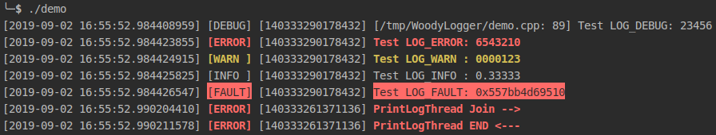
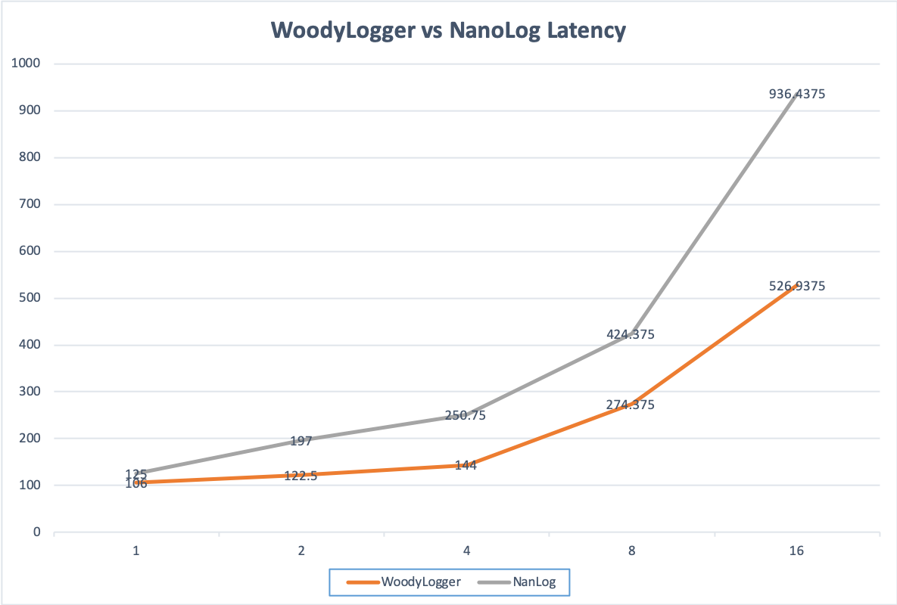
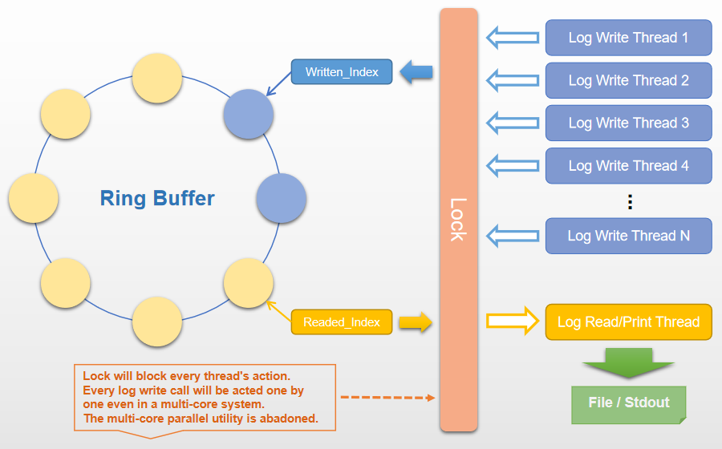
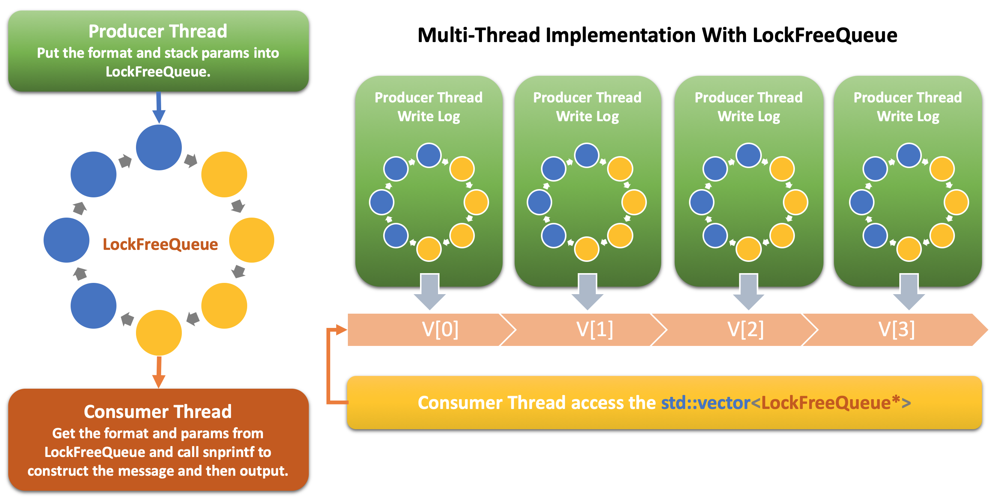

WoodyLogger Design
===========================
* ***Low Latency*** C++11 Asynchronous Logging Library.
* Lock-Free Optimized for Mulit-Core system, so it is very fast. See [Latency Benchmark](#Benchmark)
* Supports multiple log levels: FAULT, ERROR, WARN, INFO, DEBUG, TRACE
* Configurable for output to local file/stdout or both.
* Colorful output on stdout for different log level on UNIX terminal.

# Usage
``` cpp
#include "WoodyLogger.h"
#include <thread>
#include <unistd.h>

void PrintLogThread() {
    LOG_ERROR("PrintLogThread Join -->");
    LOG_ERROR("PrintLogThread END <---");
    usleep(1000);
}

int main() {
    WOODY_LOGGER_START();
    //WOODY_LOGGER_INIT("/dev/null", false);
    WOODY_LOGGER_LEVEL(woodycxx::DEBUG);

    LOG_TRACE("Test LOG_TRACE: %d", 12345);  // TRACE will output on DEBUG level
    LOG_DEBUG("Test LOG_DEBUG: %d", 23456);
    LOG_ERROR("Test LOG_ERROR: %d", 6543210);
    LOG_WARN ("Test LOG_WARN : %07d", 123);
    LOG_INFO ("Test LOG_INFO : %.5f", 1.0/3.0);
    LOG_FAULT("Test LOG_FAULT: %p", &PrintLogThread);

    std::thread print_thread1 = std::thread(PrintLogThread);
    print_thread1.join();

    return 0;
}
```


## API Description

### Macro Define: WOODY_LOGGER
In "WoodyLogger.h", there is a macro `#define WOODY_LOGGER`. User can use it to control the Log API calling comiling. If WOODY_LOGGER is not defined, any call of WOODY_LOGGER_XXXX will not be compilied. So user can put WoodyLogger in code for test and debug usage and then undefine the WOODY_LOGGER macro to turn off WoodyLogger.</br>

### WOODY_LOGGER_START
Start WoodyLogger, which starts the Consumer thread. It is just needed to be called once only. The consumer thread will keep running until [WOODY_LOGGER_STOP()](#WOODY_LOGGER_STOP) is called.</br>
`WOODY_LOGGER_START()` should be called in `main()` function, and before any [LOG_XXXX](#LOG_XXXX) call.</br>

### WOODY_LOGGER_INIT
WOODY_LOGGER_INIT marco is used to configure the log output, it has 2 parameters:</br>
`("file_path_name", is_enalbe_output_to_stdout)`</br>
e.g.</br>
`WOODY_LOGGER_INIT("./log.txt");`</br>
Will configure the log output into "./log.txt" file and also the stdout. If user want to turn-off the stdout:</br>
`WOODY_LOGGER_INIT("./log.txt", false); //disable stdout`</br>
User can also configure the FILE handler (e.g. `stdout`, `stderr`):</br>
`WOODY_LOGGER_INIT(stderr);`</br>
User can direct the file name to `"/dev/null"` and disable the stdout, then the log will NOT output any:</br>
`WOODY_LOGGER_INIT("/dev/null", false);`</br>
This is used in benchmark test. If `WOODY_LOGGER_INIT` is not configured, it will output to stdout in default as the demo shows.</br>


### WOODY_LOGGER_LEVEL
There are 6 log levels as Strong to Week order:</br>
`FAULT`, `ERROR`, `WARN`, `INFO`, `DEBUG`, `TRACE`</br>
Logger will only output the level which is stronger than the current configured level.</br>
e.g.</br>
If the level is setup to `INFO`, then `DEBUG` and `TRACE` will not be output.</br>
`WOODY_LOGGER_LEVEL()` can be called in a thread which means the log level can be controlled dynamically. User can write a thread listen to a port as a Server. The client process can connect to the server and configure the level dynamically.</br>

### LOG_XXXX
`LOG_TRACE`, `LOG_DEBUG`, `LOG_INFO`, `LOG_WARN`, `LOG_ERROR`, `LOG_FAULT`</br>

#### The output format

##### DEBUG, TRACE Level:

```[YYYY-MM-DD HH:mm:ss.nanoseconds] [LEVEL] [thread_id] [__FILE__: __LINE__] message```</br>

##### FAULT, ERROR, WARN, INFO Level:

```[YYYY-MM-DD HH:mm:ss.nanoseconds] [LEVEL] [thread_id] message```</br>

### WOODY_LOGGER_STOP
WoodyLogger will start a consumer thread print out the log message. The thread will keep running if user does not call `WOODY_LOGGER_STOP()`</br>
</br>


# Benchmark
When I search "Low-Latency C++ Log" in github, I find a very fast C++ log project: [NanoLog](https://github.com/Iyengar111/NanoLog). It has been proved much faster than [spdlog](https://github.com/gabime/spdlog) and others by itself. So I am trying to use the benchmark test code in NanoLog so that If WoodyLogger is proved fater than NanoLog, WoodyLogger will be fater than the others. NanoLog's design is so much like WoodyLogger, but WoodyLogger is optimized for multi-core system, it can take advantage in multi-thread environment.

## Benchmark Code Compiling Option And System environment
The benchmark test code is run under my MacBook Pro Laptop:</br>
``` shell
Intel(R) Core(TM) i7-4870HQ CPU @ 2.50GHz
Total Number of Cores:  4
Threads:                8
```
### Test Code
[benchmark.cpp](benchmark.cpp)</br>
WoodyLogger and NanoLog are both Compiled under `-O2` optimization level.</br>

## Benchmark Test Result

Threads	|WoodyLogger(Avg, ns)	|NanLog(Avg, ns)
--------|---------------|---------
1	|106	|125
2	|122.5	|197
4	|144	|250.75
8	|274.375	|424.375
16	|526.9375	|936.4375

</br>




# Design
WoodyLogger's aim is to impletement a Log tool that can be applied in HFT (High Frequent Trading) System. So the design of WoodyLogger is focusing on ***Log Latency*** NOT **High Throughput**, which means WoodyLogger is not going to output as many logs into file as possible, but is going to reduces the latency to nanoseconds as short as possible.

## Normal Design
### What makes the high latency of a Log tool?
* As a normal design of a "fast" log tool, I/O denseness firtly comes into developers' mind.</br>
Usually, developers isolate the log writting operation and log calling operation into two threads. There is a ring buffer storing the messages which the Log API is called. Each caller is a *Producer* which writes out the log messages into the ring buffer. There is a *Consumer* thread reads the ring buffer and then print out the msg into file or stdout, etc.
Each call of the log API will not be blocked by the I/O dely, so this is a great step to "speed up" (reduce the latency). But it is just the first step, there are more things to do.</br>
* Many developers did not realize that the **String Formatter** functions are the very important key of high latency. Such as `std::stringstream` in C++, `sprintf` in C, etc. Access [FMT](https://github.com/fmtlib/fmt#Benchmarks) for reference.</br>
The key latency of string foratter is coverting digital numbers into string. Which is very slow in those function, espicially floating-point formatting.
Although there are very quick [Integer Converting](https://github.com/fmtlib/fmt/blob/master/include/fmt/format.h#L2857) and floating-point converting implementations: [double-conversion](https://github.com/google/double-conversion), but they are not as quick as memory copy. So do NOT convert and format any digital numbers into string in Log calling, but do it in the reading/output thread.</br>

Normally the Log tool is designed as following: </br>
The key problem of latency is using the LOCK. If there are more caller threads, they will block each other even the LOCKER is a spin-lock.



## WoodyLogger Design
###  Lock-Free Queue
The Locker can be removed by using a Lock-Free Queue. When thers are only one producer and one consumer, there is not going to need a lock anymore.</br>
To achieve multi-thread support of a Logger and Lock-Free ring buffer, every thread need a **thread_local** Lock-Free ring buffer. The consumer thread orginize a std::vector<LockFreeQueue*> to access every ring buffer (LockFreeQueue) in the threads. The life-cycle of LockFreeQueue is maintained by the thead, when the thread exit, the LockFreeQueue is also destoryed and be removed from the vector.</br>
The WoodyLogger design is going to like the following diagram shows:</br>



